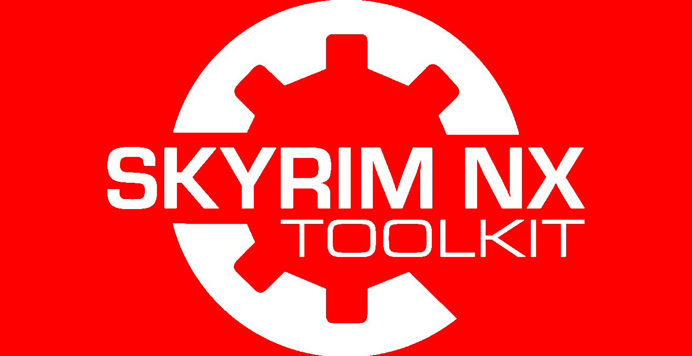

All my scripts use Python 3.x, and will attempt to locate it on your system.  If it's not added to your path, you will need to add it.  If you have both 2.x and 3.x versions installed, it will attempt to use 'py' to find where the 3.x module is.  
You can get Python here:
- Python 3.x https://www.python.org/downloads/

There are 2 folders in the toolkit folder, GraphicsTools & NvnTools, which require files that are not publicly available in order to work.  The Readme files in those folder list the files required for the SDK conversion to work.  I will not link to those files publicly.

Note that you require some external tools to run my scripts, they should be placed in the 'Utilities' directory.
The external tools are:
- nvddsinfo.exe <https://github.com/castano/nvidia-texture-tools/releases>
- textconv.exe <https://github.com/Microsoft/DirectXTex/releases>
- texdiag.exe <https://github.com/Microsoft/DirectXTex/releases>

If there's an external tool that you don't have, the scripts will attempt to download it.

There are Examples listed in the "Examples" folder.  They are filled with dummy mod files, but you should be able to run them and they should produce the appropriate output.  
Most of the scripts can be used by dragging a folder onto them, but I prefer to run them from the command line in case there's an error whilst in the batch file, so you can see it before the window disappears.  
The examples all show proper command line usage.
